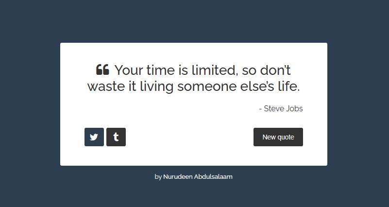

# Random Quote Machine

## Features
- Uses React.js and Animation
- Generates and displays random quotes
- Allows users to fetch new quotes with a button click
- Provides social media sharing options for Twitter and Tumblr
- Utilizes font awesome for icons
- User-friendly interface

## Usage
1. Clone the repository: `git clone https://github.com/NdAbdulsalaam/Random-Quote-App.git`
2. Navigate to the project directory: `cd Random-Quote-App`
3. Install dependencies: `npm install`
4. Start the development server: `npm run dev`
5. Open a web browser and go to `http://localhost:5173/` to view the application.

## Contributing
Contributions are welcome! If you encounter any issues or have suggestions for improvements, please feel free to open an issue or submit a pull request.

## Credits
This Random Quote Machine project is part of the [FreeCodeCamp Frontend Certification](https://www.freecodecamp.org/learn/front-end-libraries/) course. It was completed as one of the required projects in the curriculum.

Learn more about FreeCodeCamp and their educational programs on their official website: [https://www.freecodecamp.org/](https://www.freecodecamp.org/)
